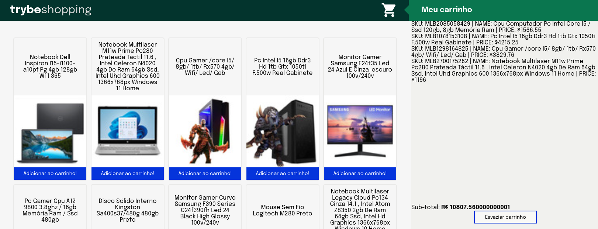

# Projeto Trybe - Shopping Cart

Neste projeto desenvolvi um carrinho de compras dinâmico consumindo dados da API do Mercado Livre.

#### Habilidades desenvolvidas:

- Fazer requisições a uma API (Application Programming Interface) do Mercado Livre;
- Utilizar os seus conhecimentos sobre JavaScript, CSS e HTML;
- Trabalhar com funções assíncronas;
- Implementar testes unitários.

#### Print da aplicação:

